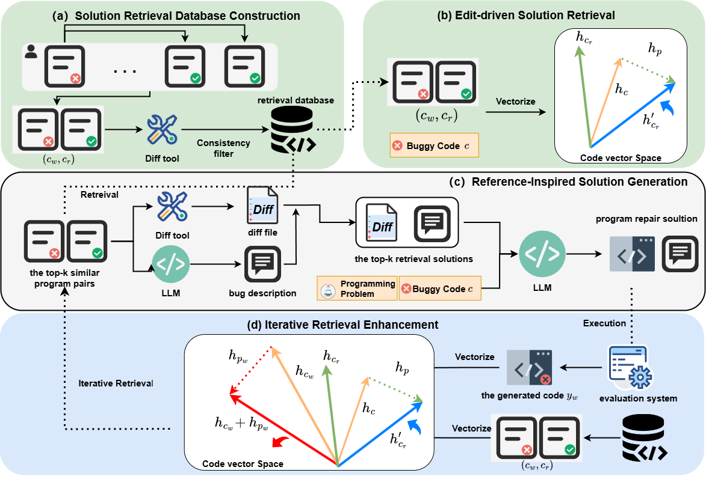

# LSGen


*Overview of LSGen*  : (a) Illustration of the Solution Retrieval Database Construction process.  (b) Illustration of Edit-driven Solution Retrieval process.  (c) Illustration of the Reference-Inspired Solution Generation process.  (d) Illustration of the Iterative Retrieval Enhancement process.

## Installation
1. Git clone our repository
2. creating conda environment:
```shell
conda create -n LLMenv python=3.10
conda activate LLMenv
conda install pytorch==2.0.1 torchvision==0.15.2 torchaudio==2.0.2 pytorch-cuda=11.8 -c pytorch -c nvidia
pip install cmake lit
pip install transformers accelerate deepspeed peft
pip install datasets
pip install numpy==1.22.4
pip install requests
pip install matplotlib
pip install codebleu
```
## Benchmark Usage

### Dataset
Our dataset is derived from the test set of ACPR filtering. 
#### 1. test cases
Download it and place it in the directory ./merged_test_cases.
#### 2. Programming problem file
Problem file in  "repairDataset/Program_Question_Data/English_Program_Question_StringVersion.json"
#### 3. Filtering
Place the dataset in the directory ./dataset, set the API and URL in `ProcessData/create_data/RepairCode.py`.
```shell
bash scripts/pipline/init_data/Repaircode.sh
```
Use the Code execution environment to execute the generated results.

### Code execution environment construction
Create an docker instance for code execution

#### 1. Download docker image
Download address: https://github.com/criyle/go-judge?tab=readme-ov-file

#### 2. Create a docker instance
```
sudo docker run -it --privileged --shm-size=256m -p 5050:5050 --name=go-judge criyle/go-judge
```

#### 3. Install the Python environment

```
apt update && apt install python3
```

#### For performing operations inside a running Docker container (if needed)
```
sudo docker exec -it go-judge /bin/bash
```
#### Restart (if necessary)
```
sudo docker restart go-judge 
```

#### Instructions for use
##### A simple usage example
1. Modify codecontent and test points in the directory (test_directory) in codeTool.ExecutiveProgram.TestExample.RunProgramAndTestPostion.Py 

2. In the codeTool/ directory, run the following command:
    ```
    python -m ExecutiveProgram.TestExample.RunProgramAndTestPostion
    ```

## Stage I: Repair Solution Retrieval Framework
### 1. Solition Retrieval Database Construction
Download CodeNet from https://developer.ibm.com/data/project-codenet/
Unzip the CodeNet in the directory ./dataset
The script is executed after specific parameter values are specified.
```shell
bash scripts/pipline/init_data/get_pairs.sh
bash scripts/pipline/init_data/get_filtered_pairs.sh
```

### 2. Edit-driven Solution Retrieval
Set the dataset path, retrieval database path, retrieval mode, retrieval model and output file path properly.
```shell
bash scripts/VectorRetrieval/VectorRetrievalMutilGPU.sh
```
## Stage II: Solution-Guided Program Repair
### 1. Reference-Inspired Solution Generation.
Use LLM to obtain the textual bug description of the retrieved solution. Set the API and URL.
```shell
bash scripts/GenerateBugDescription/GenerateBugDescription.sh
```
get the generated solution:
The script is executed after specific parameter values are specified.
```shell
# Proprietary model
bash scripts/StageToStage/RepairCodeAndExplainRetryDiff.sh
# Open-source model
bash scripts/StageToStage/Inference.sh
```

### 2. Evaluate generated results
#### 1. Test the generated code using test cases
The script is executed after specific parameter values are specified.
```shell
bash scripts/Execution/Execution_Eval.sh
```
#### 2. Evaluate generated bug descriptions by script
The script is executed after specific parameter values are specified.
```shell
bash scripts/Evaluate_Descriptions/Evaluate_Descriptions.sh
```
#### 3. Calculate the final metrics.
The script is executed after specific parameter values are specified.
```shell
bash scripts/calc_results.sh
```
### 3. Iterative Retrieval Enhancement
The script is executed after specific parameter values are specified.
```shell
# Proprietary model
bash scripts/StageToStage/RepairCodeAndExplainRetryDiff.sh
# Open-source model
bash scripts/StageToStage/Inference.sh
```
